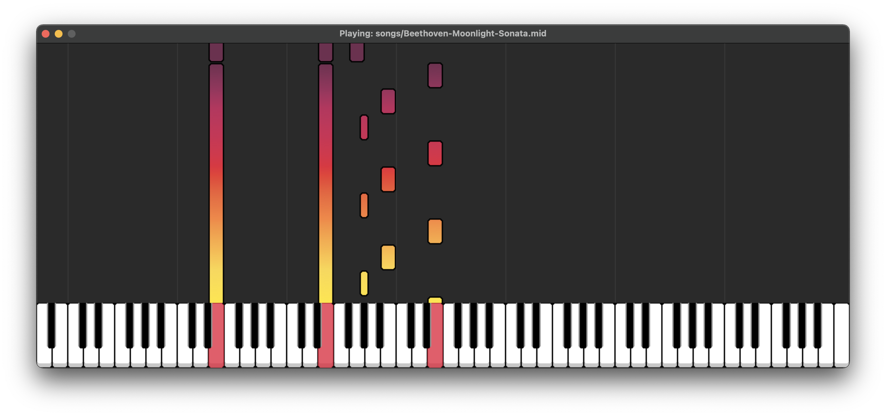

# Piano Midi Visualiser

A program created using python and pygame to visualise and play piano midi files

## Screenshot




## Run Locally

Clone the project

```bash
  git clone git@github.com:hwcrane/Piano-Midi-Visualiser.git
```

Go to the project directory

```bash
  cd Piano-Midi-Visualiser
```

Install dependencies

```bash
  pip install -r requirements.txt
```

Run the program

```bash
  python main.py path-to-midi-file
```

